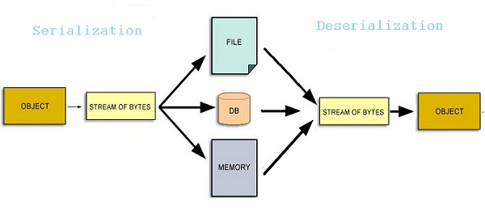
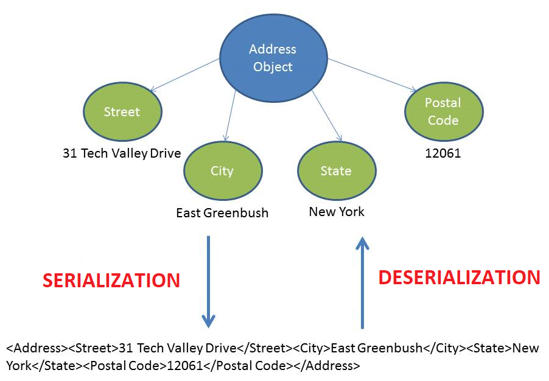

| SNo | Table of Content |
|-----|------------------|
| 1.  | [Summary](#Summary) |
| 2.  | [How Does It Work](#How-Does-It-Work) |
| 3.  | [Applications](#Applications) |
| 4.  | [Some Text based Data Serialization Formats](#Some-Text-based-Data-Serialization-Formats) |
| 5.  | [Some Binary Data Serialization Formats](#Some-Binary-Data-Serialization-Formats) |
| 6.  | [Comparison Of Various Serialization Formats On Performance Characteristics](#Comparison-Of-Various-Serialization-Formats-On-Performance-Characteristics) |
| 7.  | [References](#REFERENCES) |

## Summary
Data serialization is the process of converting data objects present in complex data structures into a byte stream for storage, transfer and distribution purposes on physical devices.

Computer systems may vary in their hardware architecture, OS, addressing mechanisms. Internal binary representations of data also vary accordingly in every environment. Storing and exchanging data between such varying environments requires a platform-and-language-neutral data format that all systems understand.

Once the serialized data is transmitted from the source machine to the destination machine, the reverse process of creating objects from the byte sequence called deserialization is carried out. Reconstructed objects are clones of the original object.

Choice of data serialization format for an application depends on factors such as data complexity, need for human readability, speed and storage space constraints. XML, JSON, BSON, YAML, MessagePack, and protobuf are some commonly used data serialization formats.

## How Does It Work
Computer data is generally organized in data structures such as arrays, tables, trees, classes. When data structures need to be stored or transmitted to another location, such as across a network, they are serialized.

For simple, linear data (number or string) there's nothing to do. Serialization becomes complex for nested data structures and object references. When objects are nested into multiple levels, such as in trees, it's collapsed into a series of bytes, and enough information (such as traversal order) is included to aid reconstruction of the original tree structure on the destination side.

When objects with pointer references to other member variables are serialized, the referenced objects are tracked and serialized, ensuring that the same object is not serialized more than once. However, all nested objects must be serializable too.

Finally, the serialized data stream is persisted in a byte sequence using a standard format. ISO-8859-1 is a popular format for 1-byte representation of English characters and numerals. UTF-8 is the world standard for encoding multilingual, mathematical and scientific data; each character may take 1-4 bytes of data in Unicode.

## Applications
Serialization allows a program to save the state of an object and recreate it when needed. Its common uses are:
- **Persisting data onto files** – happens mostly in language-neutral formats such as CSV or XML. However, most languages allow objects to be serialized directly into binary using APIs such as the Serializable interface in Java, fstream class in C++, or Pickle module in Python.
- **Storing data into Databases** – when program objects are converted into byte streams and then stored into DBs, such as in Java JDBC.
- **Transferring data through the network** – such as web applications and mobile apps passing on objects from client to server and vice versa.
- **Remote Method Invocation (RMI)** – by passing serialized objects as parameters to functions running on a remote machine as if invoked on a local machine. This data can be transmitted across domains through firewalls.
- **Sharing data in a Distributed Object Model** – when programs written in different languages (running on diverse platforms) need to share object data over a distributed network using frameworks such as COM and CORBA. However, SOAP, REST and other web services have replaced these applications now.

## Some Text-based Data Serialization Formats
- **XML (Extensible Markup Language)** - Nested textual format. Human-readable and editable. Schema based validation. Used in metadata applications, web services data transfer, web publishing.
- **CSV (Comma-Separated Values)** - Table structure with delimiters. Human-readable textual data. Opens as spreadsheet or plaintext. Used as plaintext Database.
- **JSON (JavaScript Object Notation)** - Short syntax textual format with limited data types. Human-readable. Derived from JavaScript data formats. No need of a separate parser (like XML) since they map to JavaScript objects. Can be fetched with an XMLHttpRequest call. No direct support for DATE data type. All data is dynamically processed. Popular format for web API parameter passing. Mobile apps use this extensively for user interaction and database services.
- **YAML (YAML Ain't Markup Language)** - Lightweight text format. Human-readable. Supports comments and thus easily editable. Superset of JSON. Supports complex data types. Maps easily to native data structures. Used in configuration settings, document headers, Apps with need for MySQL style self-references in relational data.

## Some Binary Data Serialization Formats
- **BSON (Binary JSON)** - Created and internally used by MongoDB. Binary format, not human-readable. Deals with attribute-value pairs like JSON. Includes datetime, bytearray and other data types not present in JSON. Used in web apps with rich media data types such as live video. Primary use is storage, not network communication.
- **MessagePack** - Designed for data to be transparently converted from/to JSON. Compressed binary format, not human-readable. Supports static typing. Supports RPC. Better JSON compatibility than BSON. Primary use is network communication, not storage. Used in apps with distributed file systems.
- **protobuf (Protocol Buffers)** - Created by Google. Binary message format that allows programmers to specify a schema for the data. Also includes a set of rules and tools to define and exchange these messages. Transparent data compression. Used in multi-platform applications due to easy interoperability between languages. Universal RPC framework. Used in performance-critical distributed applications.

## Comparison Of Various Serialization Formats On Performance Characteristics
- **Speed** – Binary formats are faster than textual formats. A late entrant, **protobuf reports the best times**. With compressed data, speed difference is even greater. For apps that aren't data intensive or real time, JSON is preferable due to readability and being schema-less. 
- **Data size** – This refers to the physical space in bytes post serialization. For small data, compressed JSON data occupies more space compared to binary formats like protobuf. With larger files, the gap narrows. Generally, **binary formats always occupy less space**.
- **Usability** – Human readable formats like JSON are naturally preferred over binary formats. For editing data, YAML is good. For complex data types, cross-platform serialization libraries allow data structure to be defined in schemas (for text formats) or IDL (for binary formats). Schema definition is easy in protobuf, with in-built tools.
- **Compatibility, extensibility** – JSON is a closed format. XML is average with schema versioning. Backward compatibility (extending schemas) is best handled by protobuf.

## REFERENCES
1. [Devopedia](https://devopedia.org/data-serialization)